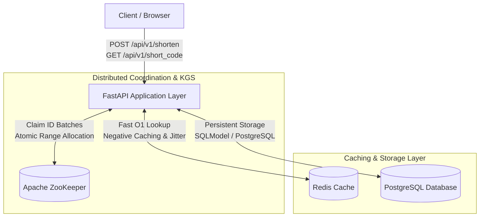
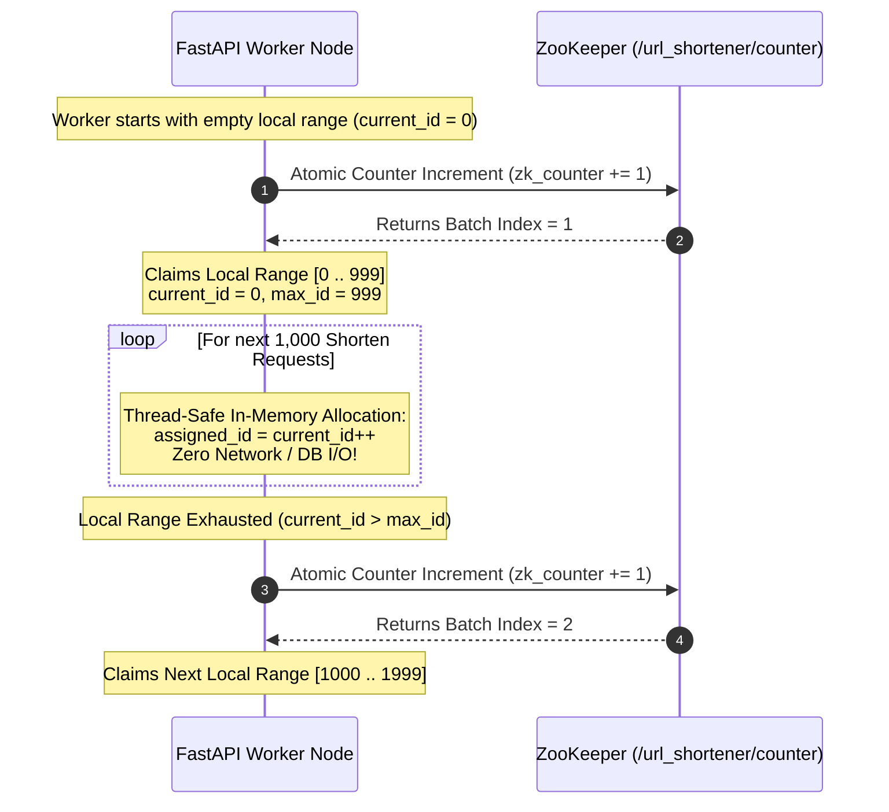
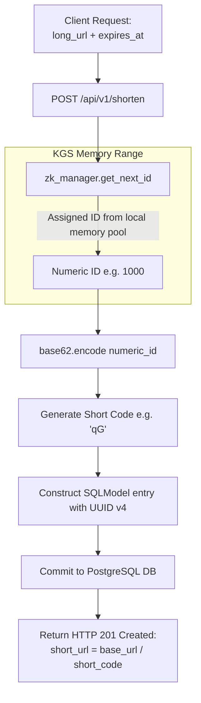
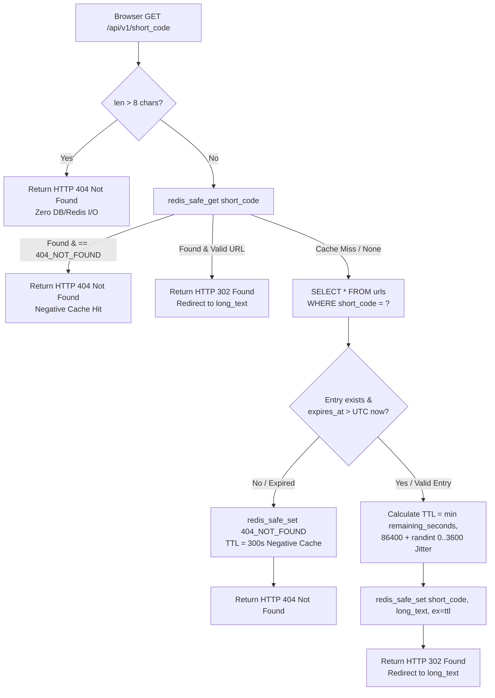

# Distributed URL Shortener: System Design & Engineering Thought Process

An industrial-strength, highly concurrent URL Shortener built with **FastAPI**, **PostgreSQL**, **Redis**, and **Apache ZooKeeper**. 

Unlike naive tutorials that rely on auto-incrementing database IDs or basic MD5 hashing, this repository implements **real-world distributed systems patterns** designed to scale to billions of URLs while maintaining sub-millisecond redirect latencies ($O(1)$ reads) and strict high availability ($99.99\%+$).

---

## 📖 Table of Contents
1. [The Engineering Challenge & Scale Considerations](#1-the-engineering-challenge--scale-considerations)
2. [High-Level Architecture](#2-high-level-architecture)
3. [The Core Problem: Zero-Collision ID Generation at Scale](#3-the-core-problem-zero-collision-id-generation-at-scale)
    - [Why Hashing (MD5 / SHA-256) Fails](#why-hashing-md5--sha-256-fails)
    - [Why Auto-Increment Sequence Bottlenecks Fail](#why-auto-increment-sequence-bottlenecks-fail)
    - [Solution: Range-Based Distributed ID Generation (ZooKeeper + Base62)](#our-solution-range-based-distributed-id-generation-zookeeper--base62)
4. [Tackling Real-World Distributed Caching Nightmares](#4-tackling-real-world-distributed-caching-nightmares)
    - [Problem 1: Cache Stampedes (The Thundering Herd Problem) & Jitter](#problem-1-cache-stampedes-the-thundering-herd-problem--jitter)
    - [Problem 2: Cache Penetration (DoS Attacks via Non-Existent Keys) & Negative Caching](#problem-2-cache-penetration-dos-attacks-via-non-existent-keys--negative-caching)
    - [Problem 3: Cache Outages & Fail-Open Resilience](#problem-3-cache-outages--fail-open-resilience)
5. [Database Design & Timezone Normalization](#5-database-design--timezone-normalization)
6. [Request Lifecycle Walkthroughs](#6-request-lifecycle-walkthroughs)
7. [Getting Started & Local Development](#7-getting-started--local-development)
8. [Available Makefile Commands](#8-available-makefile-commands)

---

## 1. The Engineering Challenge & Scale Considerations

When designing a URL shortener, the system characteristics dictate the architecture:
* **Heavily Read-Biased ($100:1$ Read-to-Write Ratio):** For every $1$ URL shortened, there are typically $100+$ redirects (`302 Found`). Redirect latency must be optimized to the absolute minimum (ideally served straight from in-memory cache without hitting disk).
* **Massive Code Space:** If we generate 100 million URLs per month, our short code space must support billions of unique combinations without running into birthday paradox collisions.
* **Resilience Under Extreme Spikes:** When a shortened link goes viral on social media or is broadcast on live television, traffic to a single key can surge from $10\text{ req/sec}$ to $50,000\text{ req/sec}$ instantly. The system must degrade gracefully without crashing downstream databases.

---

## 2. High-Level Architecture



The application is organized into decoupled tiers:
* **API Layer (`app/api/endpoints.py`):** Stateless FastAPI workers serving HTTP endpoints (`/api/v1/shorten` and `/api/v1/{short_code}`).
* **Distributed Key Generation Service (`app/core/zookeeper.py`):** Apache ZooKeeper manages range allocations to guarantee globally unique, sequential numeric IDs across distributed worker nodes without database coordination.
* **Caching Layer (`app/core/redis.py`):** Redis 8 stores active `short_code -> long_url` mappings with jittered TTLs and negative cache sentinels (`404_NOT_FOUND`).
* **Persistent Layer (`app/models/url_models.py` & PostgreSQL):** Relational storage mapping UUID v4 primary keys (`id`) to indexed short codes (`short_code`), URLs (`long_text`), and expiration timestamps (`expires_at`).

---

## 3. The Core Problem: Zero-Collision ID Generation at Scale

The defining architectural decision of a URL shortener is: **How do we generate short, URL-safe codes (e.g., `aB9zX`) that are guaranteed to be unique?**

### Why Hashing (MD5 / SHA-256) Fails
A common naive approach is taking `MD5(long_url)` and taking the first 7 characters. 
* **The Problem:** Hashes collide! Because of the birthday paradox, as your database grows, two different long URLs will eventually produce the same 7-character prefix. 
* **The Cost:** To handle hash collisions, you must query the database (`SELECT 1 FROM urls WHERE short_code = ?`) before inserting. If a collision occurs, you must re-hash (`MD5(long_url + timestamp)`) and retry. Under heavy write throughput, this $O(1)$ write degrades into an $O(N)$ retry loop, exhausting database connections.

### Why Auto-Increment Sequence Bottlenecks Fail
Another common approach is letting PostgreSQL generate `AUTOINCREMENT` integer IDs and base62-encoding them on insert.
* **The Problem:** The database sequence becomes a single write bottleneck ($1$ round-trip per URL). If you horizontally scale your database (sharding across multiple primary nodes), synchronizing auto-incrementing IDs across independent database instances requires distributed locks or high-latency two-phase commits.

### Solution: Range-Based Distributed ID Generation (ZooKeeper + Base62)

To eliminate both collision checks and database write bottlenecks, I implemented a **Distributed Key Generation Service (KGS)** using **Apache ZooKeeper** (`ZooKeeperTokenManager` in [app/core/zookeeper.py](file:///home/anuragpandey/Projects/url-shortener/app/core/zookeeper.py)):



1. **Batch Allocation via Distributed Counter:** When a worker starts up or exhausts its local pool of IDs, it connects to ZooKeeper and atomically increments `/url_shortener/counter`.
2. **Local Memory Claim:** If ZooKeeper returns batch index `1` (with `range_size = 1000`), the worker claims the numeric block `[0 .. 999]`. If another worker concurrently increments the counter, it receives batch `2` (`[1000 .. 1999]`). **No two nodes will ever share an ID.**
3. **Lock-Free Local Allocation:** For the next $1,000$ URL shortenings, the worker assigns unique numeric IDs entirely from local RAM (`assigned_id = self.current_id; self.current_id += 1`) under a thread lock (`self.lock`).
    * **Result:** **Zero network or database round-trips for ID generation across 99.9% of write requests!** Throughput is limited only by CPU speed, and collisions are mathematically impossible without checking the DB.
4. **Base62 Encoding:** The unique integer (e.g., `123456789`) is encoded using **Base62 (`[0-9a-zA-Z]`)** ([endpoints.py:L38](file:///home/anuragpandey/Projects/url-shortener/app/api/endpoints.py#L38)). With our maximum short code length of 8 characters (`MAX_SHORT_CODE_LENGTH = 8`), Base62 gives us $62^8 \approx \mathbf{218.34\text{ trillion}}$ unique combinations—enough to shorten 10,000 URLs per second for over 690 years without running out of space.

---

## 4. Tackling Real-World Distributed Caching Nightmares

A URL shortener's read path (`GET /{short_code}`) lives and dies by its caching strategy. While adding Redis (`redis.get()`) is straightforward, operating high-throughput caches in production introduces three severe failure modes. Here is the natural thought process behind how I solved each of them.

---

### Problem 1: Cache Stampedes (The Thundering Herd Problem) & Jitter

#### 🤔 The Thought Process & Scenario
Imagine a major news site links to our short URL `/api/v1/breakingNews`, generating $10,000\text{ req/sec}$. Redis caches the destination URL with a fixed 24-hour TTL (`86,400 seconds`).
Exactly 24 hours later, at `T+86400s`, the Redis key expires and is evicted.
In that exact second, $10,000$ concurrent requests hit our API. They all check `redis_safe_get("breakingNews")` simultaneously, receive `None` (cache miss), and **all $10,000$ worker threads query PostgreSQL (`SELECT * FROM urls WHERE short_code = 'breakingNews'`) at the exact same millisecond.**

This is known as a **Cache Stampede (Thundering Herd)**. The database connection pool instantly saturates, CPU usage spikes to 100%, disk I/O locks up, and the entire database cluster collapses under the stampede.

#### 🛠️ Solution: Randomized TTL Jitter
To prevent keys from expiring simultaneously, we never assign fixed, deterministic TTLs. Instead, when caching a database result in Redis, we inject a **randomized jitter between 0 and 60 minutes (`randint(0, 3600)`)** ([endpoints.py:L93-L98](file:///home/anuragpandey/Projects/url-shortener/app/api/endpoints.py#L93-L98)):

```python
# endpoints.py: Adding randomized jitter (up to 60 minutes) to the 24-hour Redis TTL
jitter = randint(CACHE_JITTER_MIN_SECONDS, CACHE_JITTER_MAX_SECONDS)  # 0 to 3600s
if expires_at:
    ttl = min(int((expires_at - now).total_seconds()), CACHE_TTL_SECONDS + jitter)
else:
    ttl = CACHE_TTL_SECONDS + jitter
    
redis_safe_set(redis_client, short_code, entry.long_text, ex=ttl)
```

By smearing the expiration times across a wide 60-minute window ($24\text{ hours} \pm 1\text{ hour}$), even if millions of URLs were shortened during the exact same spike, their Redis cache entries will expire gradually at different seconds throughout the day. Only $1$ or $2$ requests will hit the database at a time when refreshing cache keys, keeping database load completely flat.

---

### Problem 2: Cache Penetration (DoS Attacks via Non-Existent Keys) & Negative Caching

#### 🤔 The Thought Process & Scenario
A malicious actor or an aggressive web crawler decides to attack our API. Instead of querying legitimate links, they flood our servers with $20,000\text{ req/sec}$ for random, non-existent short codes:
`GET /api/v1/abcd1111` -> `GET /api/v1/zzzz9999` -> `GET /api/v1/fakeCode`

Because these codes do not exist in our system:
1. `redis.get("abcd1111")` returns `None` (cache miss).
2. The application queries PostgreSQL (`SELECT * FROM urls WHERE short_code = 'abcd1111'`).
3. PostgreSQL returns nothing (`None`), and the API returns `HTTP 404 Not Found`.

Because the item does not exist, standard caching logic never writes anything back to Redis! Every single malicious request bypasses Redis entirely and hits PostgreSQL directly. This **Cache Penetration** attack easily exhausts database read bandwidth and takes down the service.

#### 🛠️ Solution: $O(1)$ Early Validation + Negative Caching (`404_NOT_FOUND`)
We combat cache penetration using a two-layered defense strategy ([endpoints.py:L67-L91](file:///home/anuragpandey/Projects/url-shortener/app/api/endpoints.py#L67-L91)):

1. **Early Length Validation ($O(1)$ Rejection without I/O):**
   We enforce a hard length ceiling (`MAX_SHORT_CODE_LENGTH = 8`). If a request arrives for `/api/v1/thisCodeIsWayTooLong123`, we immediately raise `HTTP 404` at the router level ([endpoints.py:L67-L68](file:///home/anuragpandey/Projects/url-shortener/app/api/endpoints.py#L67-L68)) **before opening a Redis connection or querying PostgreSQL**.

2. **Negative Caching with Sentinel Values (`NEGATIVE_CACHE_VALUE = "404_NOT_FOUND"`):**
   When a valid-length short code is queried and turns out not to exist in PostgreSQL (or has already expired), we explicitly cache that negative result in Redis for **5 minutes (`NEGATIVE_CACHE_TTL_SECONDS = 300`)**:

```python
if not entry or (expires_at and expires_at <= now):
    # Negative caching to protect against abuse with random non-existent short_code
    redis_safe_set(redis_client, short_code, NEGATIVE_CACHE_VALUE, ex=NEGATIVE_CACHE_TTL_SECONDS)
    raise HTTPException(status_code=status.HTTP_404_NOT_FOUND)
```

When the attacker sends their second request for `GET /api/v1/abcd1111`, `redis_safe_get()` returns `"404_NOT_FOUND"`. The application checks the sentinel ([endpoints.py:L74-L75](file:///home/anuragpandey/Projects/url-shortener/app/api/endpoints.py#L74-L75)) and instantly returns `HTTP 404 Not Found` directly from memory. The database is shielded from repetitive bogus lookups!

---

### Problem 3: Cache Outages & Fail-Open Resilience

#### 🤔 The Thought Process & Scenario
What happens if the Redis container runs out of memory (`OOM`), encounters a transient TCP packet drop, or is being restarted for an upgrade?
In naive implementations, calling `redis_client.get(key)` during an outage raises an unhandled `redis.RedisError`. Fast API catches the unhandled exception and returns `HTTP 500 Internal Server Error` to the user.
Even though PostgreSQL is healthy and fully capable of serving redirects, the entire application becomes unusable because a non-essential caching layer went down!

#### 🛠️ Solution: Fail-Open Cache Wrappers (`redis_safe_get` / `redis_safe_set`)
We treat the cache as an **ephemeral optimization layer, never a hard dependency**. All Redis calls are wrapped in fail-open resilience helpers ([app/core/redis.py:L9-L23](file:///home/anuragpandey/Projects/url-shortener/app/core/redis.py#L9-L23)):

```python
def redis_safe_get(redis_client: Redis, key: str) -> Optional[str]:
    """Fail-open on Redis lookup errors ensures API availability if cache goes down."""
    try:
        return redis_client.get(key)
    except redis.RedisError:
        return None  # Gracefully fall back to PostgreSQL query!


def redis_safe_set(redis_client: Redis, key: str, value: str, ex: int) -> None:
    """Silently catching exceptions on Redis writes prevents non-critical cache failures from breaking requests."""
    try:
        redis_client.set(key, value, ex=ex)
    except redis.RedisError:
        pass  # Do not fail the user's 302 Redirect just because cache update failed!
```

If Redis dies, `redis_safe_get()` returns `None`. The request seamlessly falls back to PostgreSQL, finds the URL, serves the `302 Found` redirect, and `redis_safe_set()` silently catches any write error. **The system trades a temporary increase in database read latency for 100% uptime.**

---

## 5. Database Design & Timezone Normalization

The persistence layer uses **SQLModel** (built on top of SQLAlchemy and Pydantic) to map our schema strictly ([app/models/url_models.py](file:///home/anuragpandey/Projects/url-shortener/app/models/url_models.py)):

```python
class URLs(SQLModel, table=True):
    id: uuid.UUID = Field(primary_key=True)
    short_code: str = Field(max_length=8, index=True, unique=True)
    long_text: str
    click_count: int = Field(default=0)
    expires_at: datetime
    created_at: datetime = Field(default_factory=lambda: datetime.now(timezone.utc))
```

### Architectural Decisions in the Schema:
* **Decoupled Primary Key (`id: UUID v4`) vs. Lookups (`short_code: str`):** We do not use `short_code` as the relational Primary Key. By assigning a random UUID v4 as the primary key, we decouple our public-facing URL codes from our internal storage indexing. This enables painless sharding across multiple PostgreSQL instances or database migrations without re-keying or index fragmentation.
* **Indexed Unique `short_code` (`index=True, unique=True`):** Ensures $O(\log N)$ B-Tree lookups when queries fall back to the database on a cache miss.
* **Strict UTC Timezone Normalization (`tzinfo=timezone.utc`):** Python raises `TypeError` when comparing timezone-aware and timezone-naive datetimes. When reading timestamps from relational drivers, [endpoints.py:L84-L85](file:///home/anuragpandey/Projects/url-shortener/app/api/endpoints.py#L84-L85) explicitly checks `entry.expires_at.tzinfo is None` and normalizes naive timestamps to UTC (`expires_at.replace(tzinfo=timezone.utc)`). This guarantees precise, bug-free expiration evaluation (`expires_at <= now`).

---

## 6. Request Lifecycle Walkthroughs

### Write Path: `POST /api/v1/shorten`



### Read Path: `GET /api/v1/{short_code}`



---

## 7. Getting Started & Local Development

### Prerequisites
* **Python 3.14+**
* **uv** (Fast Python package and project manager)
* **Docker & Docker Compose** (For running local ZooKeeper and Redis)
* **PostgreSQL** (Local or containerized instance)

### Setup Instructions

1. **Clone the repository and install dependencies:**
   ```bash
   git clone <repository_url>
   cd url-shortener
   make install
   ```

2. **Configure Environment Variables (`.env`):**
   Ensure your `.env` file matches your local PostgreSQL credentials (configured via `pydantic_settings` with `shortener_` prefix):
   ```ini
   shortener_database_username=postgres
   shortener_database_password=secret
   shortener_database_hostname=localhost
   shortener_database_port=5432
   shortener_database_name=url_shortener_db
   ```

3. **Start Distributed Infrastructure (ZooKeeper & Redis):**
   Launch local ZooKeeper (`localhost:2181`) and Redis (`localhost:6379`) via Docker Compose:
   ```bash
   make docker-up
   ```

4. **Run Alembic Database Migrations:**
   Initialize and upgrade your PostgreSQL schema (`URLs` table):
   ```bash
   make migrate
   ```

5. **Run the Development Server:**
   Start the FastAPI app with live-reload enabled:
   ```bash
   make dev
   ```
   The API will be available at `http://localhost:8000`. You can test health via `GET http://localhost:8000/status`.

---

## 8. Available Makefile Commands

We provide a comprehensive `Makefile` to streamline development workflows:

| Command | Description |
| :--- | :--- |
| `make install` | Sync and install all dependencies into `.venv` using `uv sync`. |
| `make dev` / `make run` | Launch the development server using `uvicorn` on port `8000` with `--reload`. |
| `make test` | Run the full suite of unit and integration tests (`pytest -v`). |
| `make migrate` | Apply all pending database migrations (`alembic upgrade head`). |
| `make migration m="msg"` | Autogenerate a new Alembic migration revision with the provided message. |
| `make docker-up` | Start local `zookeeper:3.8` and `redis:alpine` containers in the background. |
| `make docker-down` | Stop and tear down all local Docker Compose infrastructure. |
| `make clean` | Clean out `__pycache__`, `.pytest_cache`, and compiled `.pyc` artifacts. |

---

### Running Tests
The test suite utilizes `pytest` and `pytest-mock` to test ZooKeeper range logic, redirect caching, and negative cache behavior (`tests/test_zookeeper.py`, `tests/test_redirect.py`, `tests/test_shorten.py`):

```bash
make test
```
